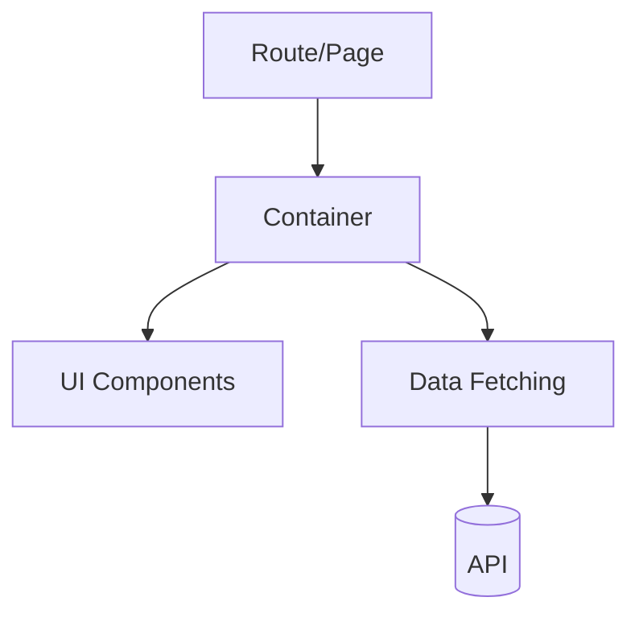

# <Feature Name> 前端技术方案

## 1. 背景与目标

- 背景：
- 目标（可衡量）：
- 非目标（明确不做什么）：
- 成功标准（验收口径）：

## 2. 用户与关键流程

- 目标用户/角色：
- 关键用户路径（按步骤）：
- 异常路径（权限不足/失败/空状态）：

## 3. 范围与需求拆解

- 功能清单：
- 交互细节（表单校验、提示、撤销/重试）：
- 边界条件：

## 4. 数据与接口契约

- 领域对象（字段、关系、约束）：
- API 列表：
  - `GET/POST ...`：请求/响应字段（含分页、排序、过滤）
- 缓存策略（key、失效/刷新时机）：

## 5. 前端架构设计

- 页面/路由/入口：
- 组件分层（容器/展示/通用组件）：
- 状态管理（本地/全局/服务端状态边界）：
- 数据流（拉取、变更、乐观更新、回滚）：
- 表单与校验策略：

### 架构图（可选，推荐 Mermaid）

## 6. UX 细节与可用性

- Loading/Empty/Error 状态定义：
- 可访问性（键盘、ARIA、焦点管理）：
- i18n/l10n（如需要）：

## 7. 非功能性要求

- 性能预算（路由级、列表虚拟化、拆包/懒加载）：
- 兼容性（浏览器/设备）：
- 安全与隐私（鉴权、PII、XSS/CSRF）：
- 观测性（埋点、日志、错误上报）：

## 8. 风险与权衡

- 风险清单（概率/影响/应对）：
- 备选方案与取舍：

## 9. 测试策略

- 单测：
- 集成测试：
- E2E：
- 用例清单（含边界与异常）：

## 10. 发布与回滚

- 灰度/开关（feature flag）：
- 回滚策略：
- 监控指标（发布后 24h）：

## 11. 任务拆解（可执行）

| Task | Owner | Scope | Acceptance Check |
|---|---|---|---|
|  |  |  |  |

## 12. 未决问题（Open Questions）

- 
